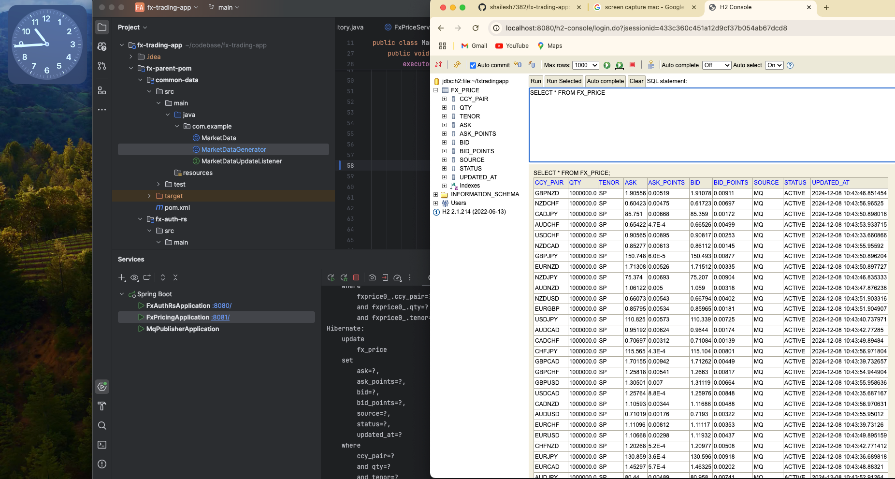
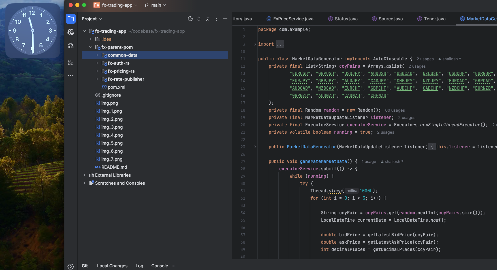
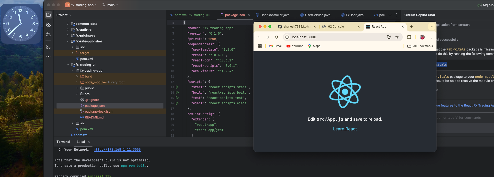
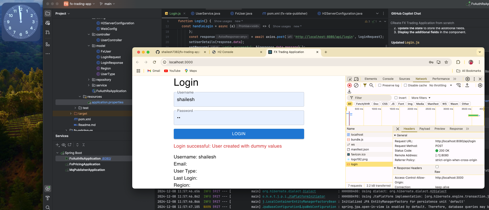
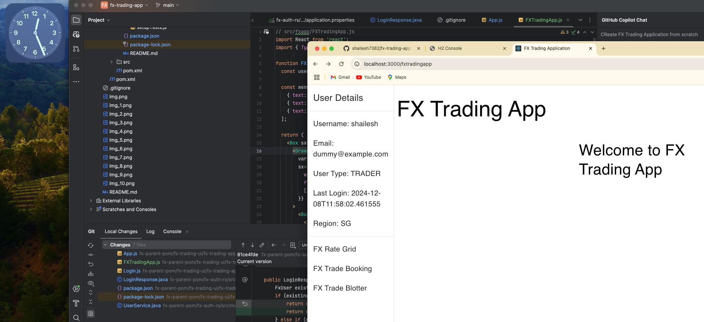
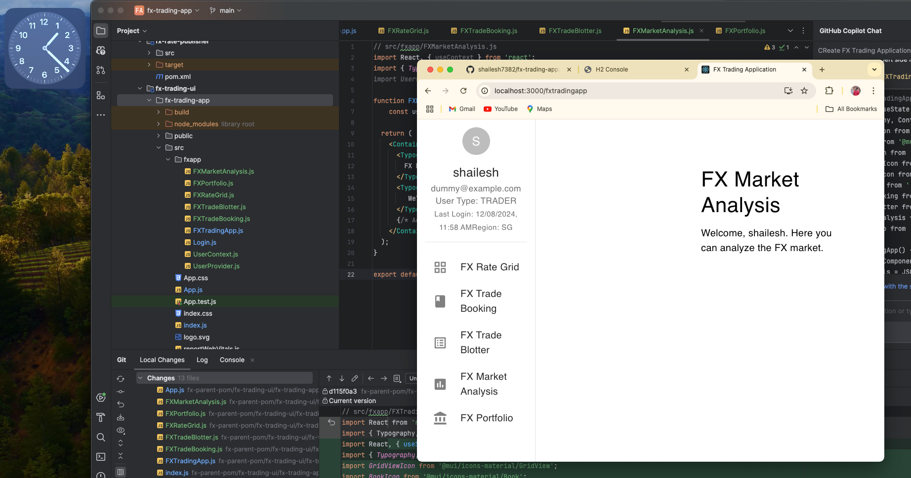
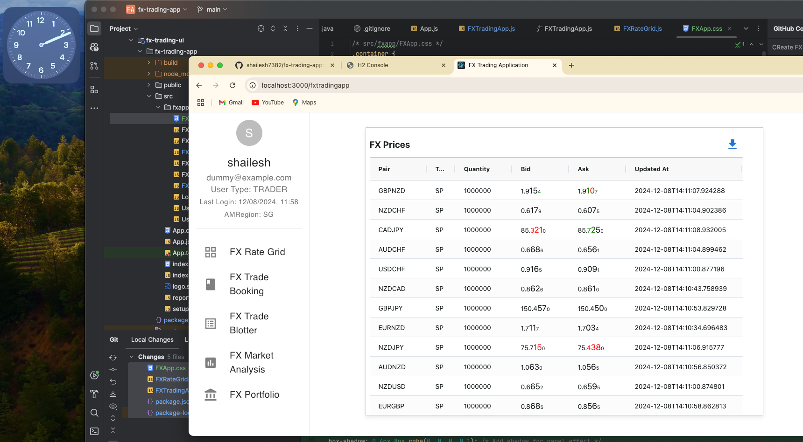

# fx-trading-app
This is FX Trading application that streams FX Rates and allows users to trade on it. 
This is a java project designed using Spring Boot, React JS, Active MQ, H2 Database . It is build using maven and npm for JDK 11. 

## Getting Started
To get you started you can simply clone the `fx-trading-app` repository and open in IntelliJ IDEA.

- create a parent pom extending spring  boot. 

- create a child pom for user login and authentication and persistence of user to db 

- Now fully running for fx-auth-rs with user login and persistence to db.

- Now created common data to generate pricing for 30 ccy pairs using a controlled random in place. 

- We have created ActiveMQ Application that is publishing market data to mq topic every 500ms for 28 pairs.

- created fx-pricing-rs to subscribe to MQ for prices and persiste them in data base. 
Also host rest api for retrieving prices.

- Testing all of it together with DB 

- <BREAK> Starting again - We will create a react js ui not to provide for a user login and a rate grid using the built backend services

- created a demo react app 

fx-parent-pom/
├── fx-trading-ui/
│   ├── src/
│   │   ├── main/
│   │   │   ├── java/
│   │   │   │   └── com/example/fxtradingui/
│   │   │   │       └── ReactAppController.java
│   │   │   ├── resources/
│   │   │   │   └── static/
│   │   │   │       ├── index.html
│   │   │   │       ├── static/
│   │   │   │       ├── asset-manifest.json
│   │   │   │       ├── manifest.json
│   │   │   │       ├── robots.txt
│   │   │   │       └── ...
│   ├── pom.xml
│   └── fx-trading-app/
│       ├── public/
│       ├── src/
│       ├── package.json
│       ├── package-lock.json
│       └── ...

- Now login screen linked to server backend and logged in 

- Created FX Trading Navigation 

- Created Menu options and navigation

- Rate Grid added to retrieve prices from backend service

- OVER and Out for today