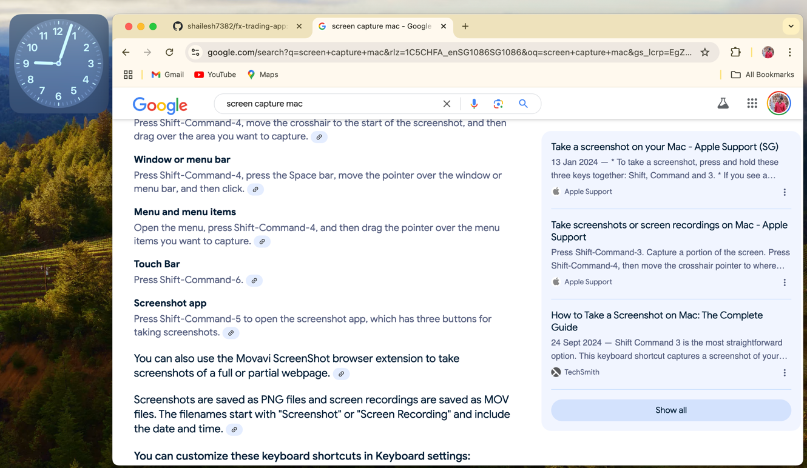
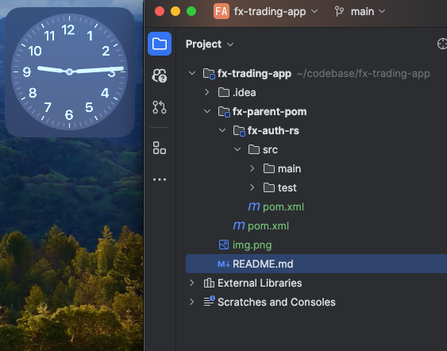
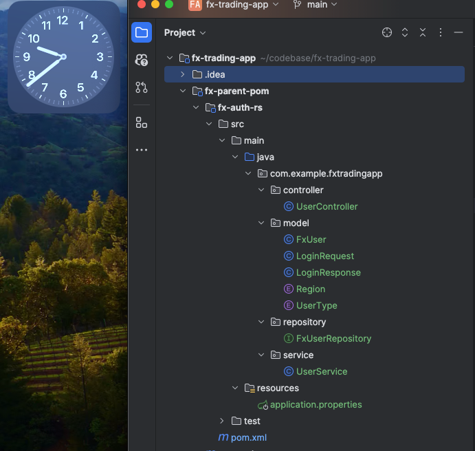
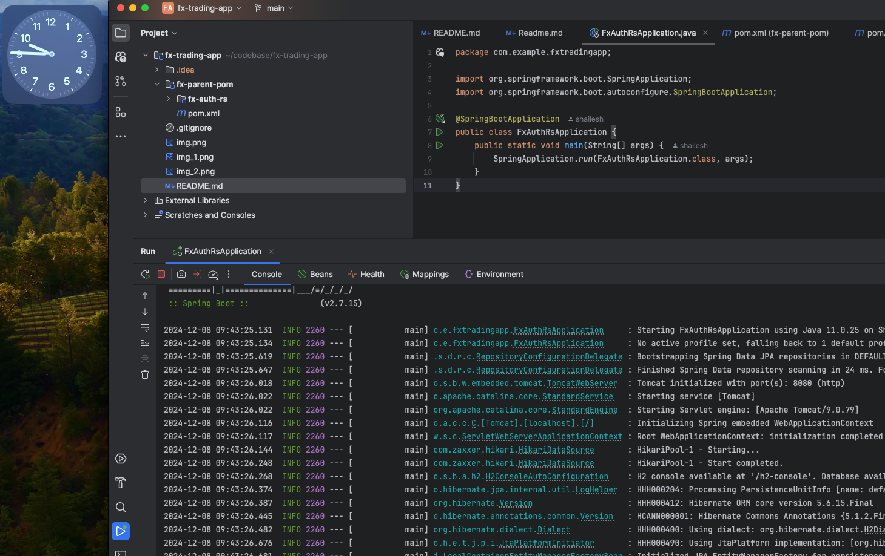
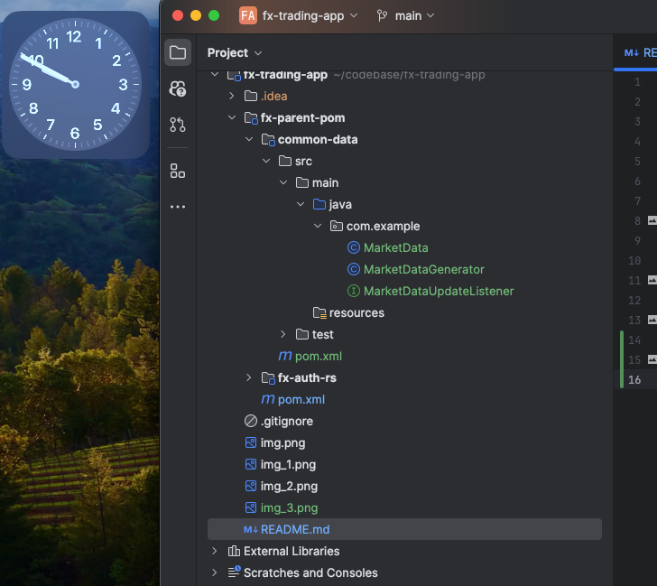
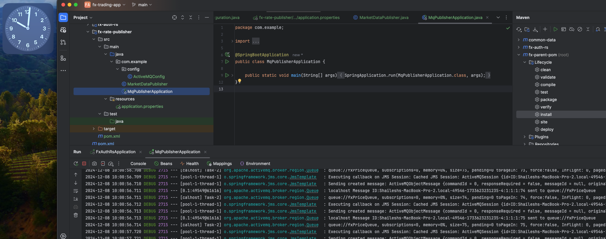
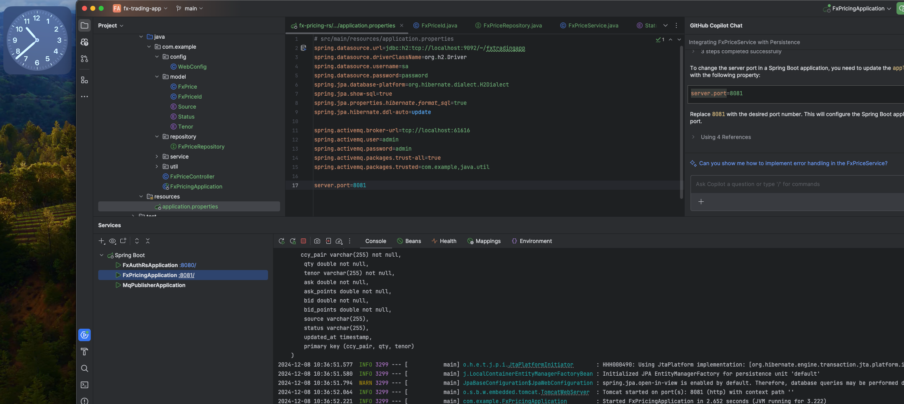

# fx-trading-app
This is FX Trading application that streams FX Rates and allows users to trade on it. 
This is a java project designed using Spring Boot, React JS, Active MQ, H2 Database . It is build using maven and npm for JDK 11. 

## Getting Started
To get you started you can simply clone the `fx-trading-app` repository and open in IntelliJ IDEA.

- create a parent pom extending spring  boot. 
- 
- create a child pom for user login and authentication and persistence of user to db 
- 
- Now fully running 
- 
- Now created common data to generate pricing for 30 ccy pairs using a controlled random in place. 
- 
- We have created ActiveMQ Application that is publishing market data to mq topic every 500ms for 28 pairs.
- 
- created fx-pricing-rs to subscribe to MQ for prices and persiste them in data base. 
Also host rest api for retrieving prices.
- 