# fx-trading-app

FX Trading application that streams FX rates and allows users to trade.

The platform is built with Spring Boot services, a React UI, ActiveMQ for streaming market data, and H2 Database for persistence. The project uses Maven (Java modules) and npm (UI module).

## Getting Started

Clone the repository and open it in IntelliJ IDEA.

## Development Progress (Screenshots)

> All screenshots are now organized under `images/`.

Initial setup
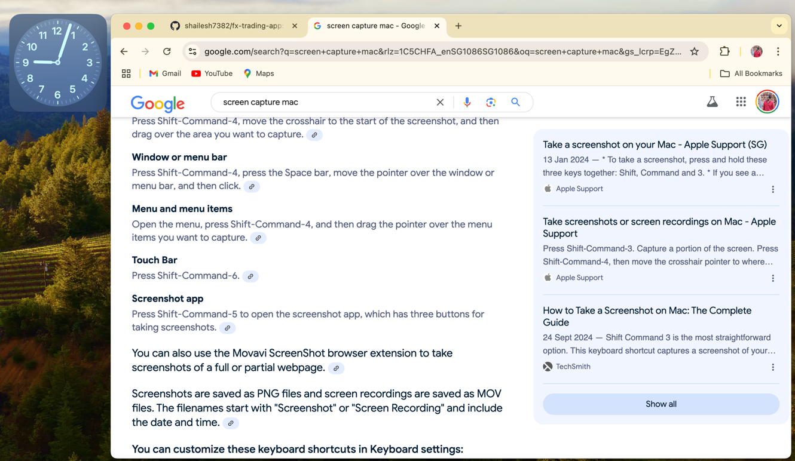

Created parent POM extending Spring Boot
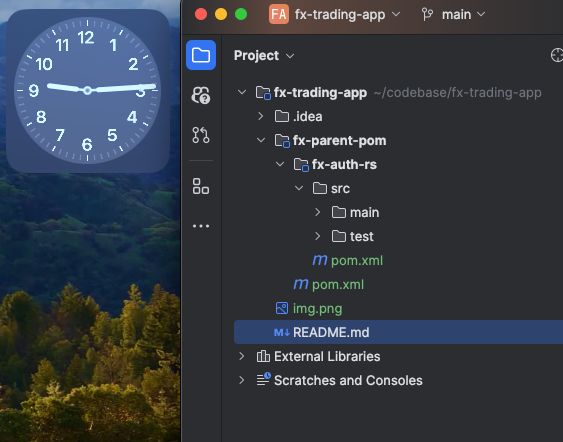

Created auth service module and DB persistence for users
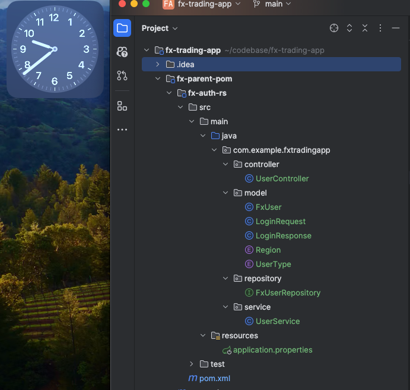

`fx-auth-rs` running with login and persistence
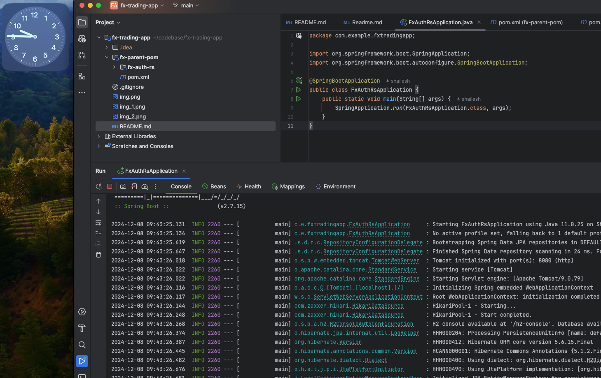

Created common market data generator for 30 currency pairs
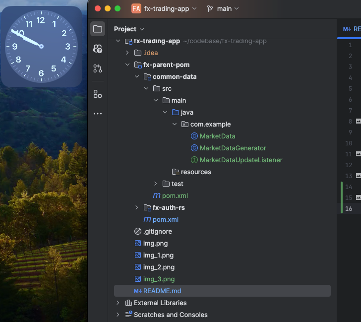

Created ActiveMQ publisher streaming market data every 500ms for 28 pairs
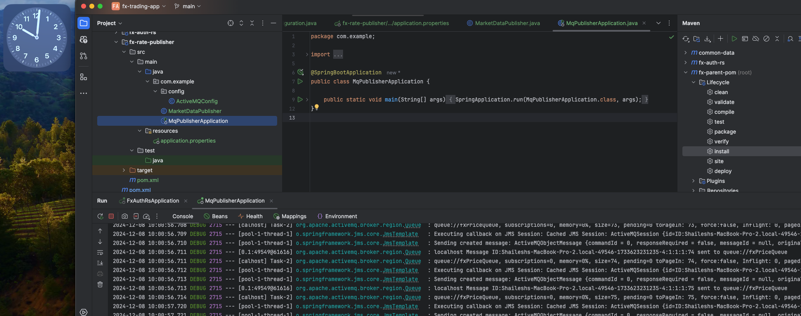

Created `fx-pricing-rs` subscriber, DB persistence, and REST API for prices
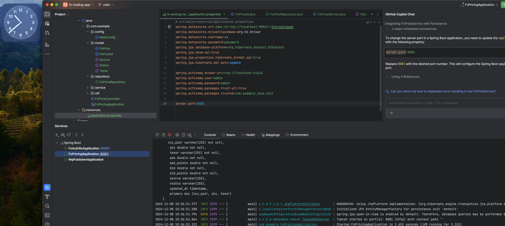

Integrated backend services with database
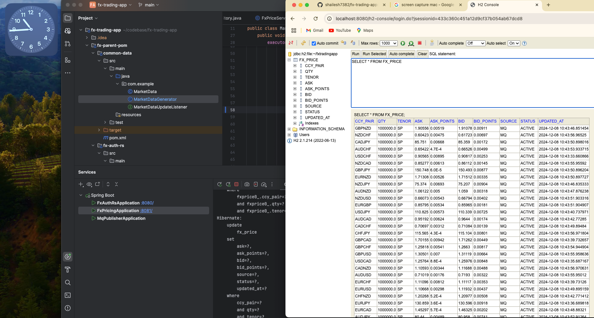

Started React UI development for login and rate grid
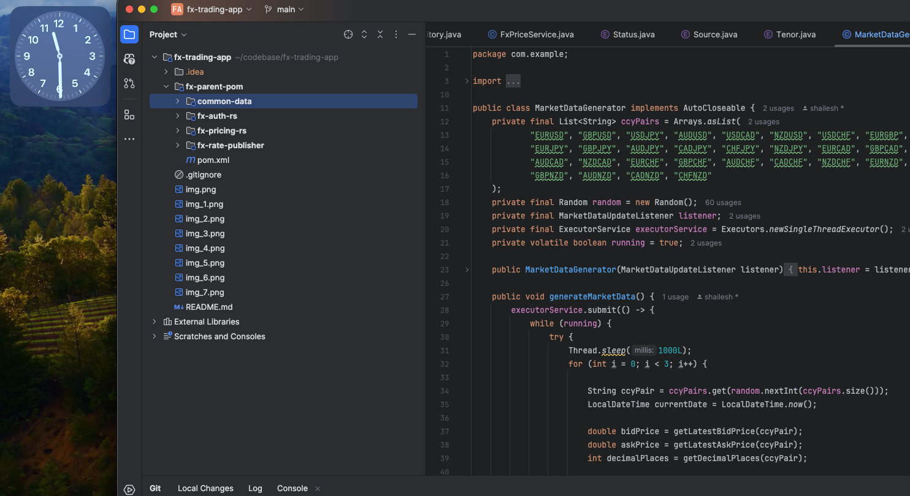

Created demo React app
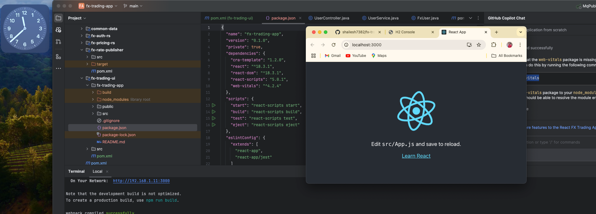

Connected login screen to backend authentication
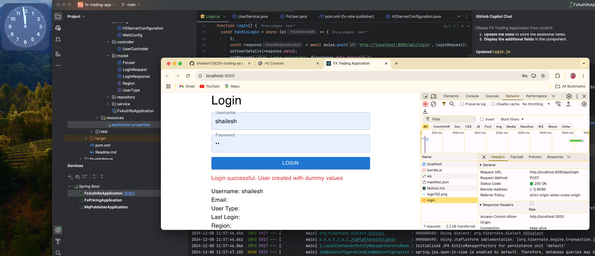

Created FX trading navigation
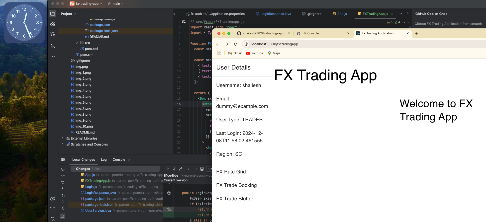

Added menu options and navigation flow
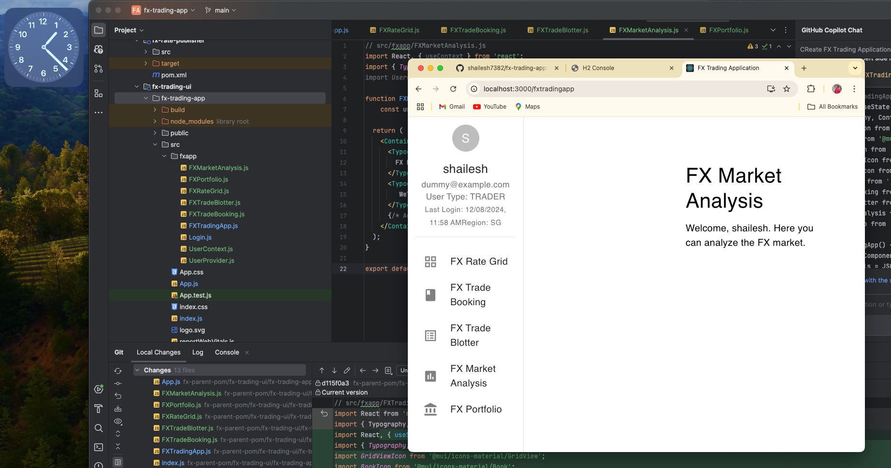

Added rate grid fetching prices from backend service
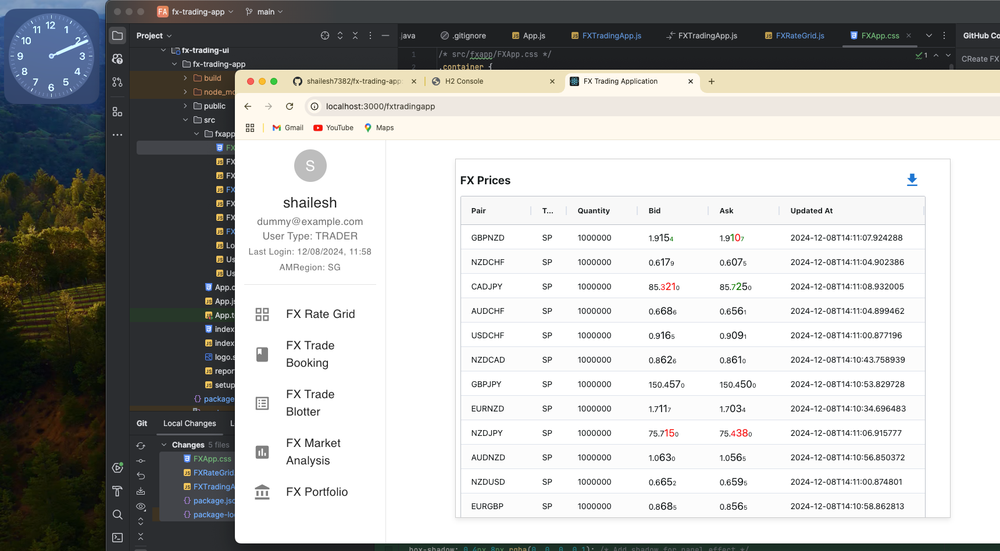

Done for the day.
