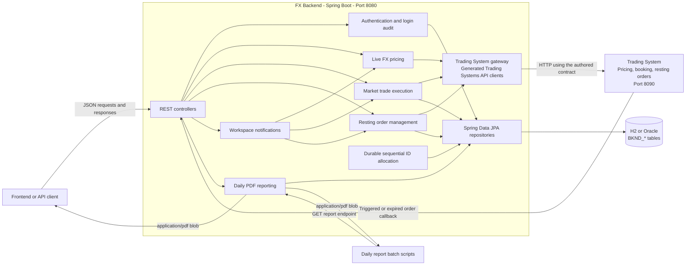
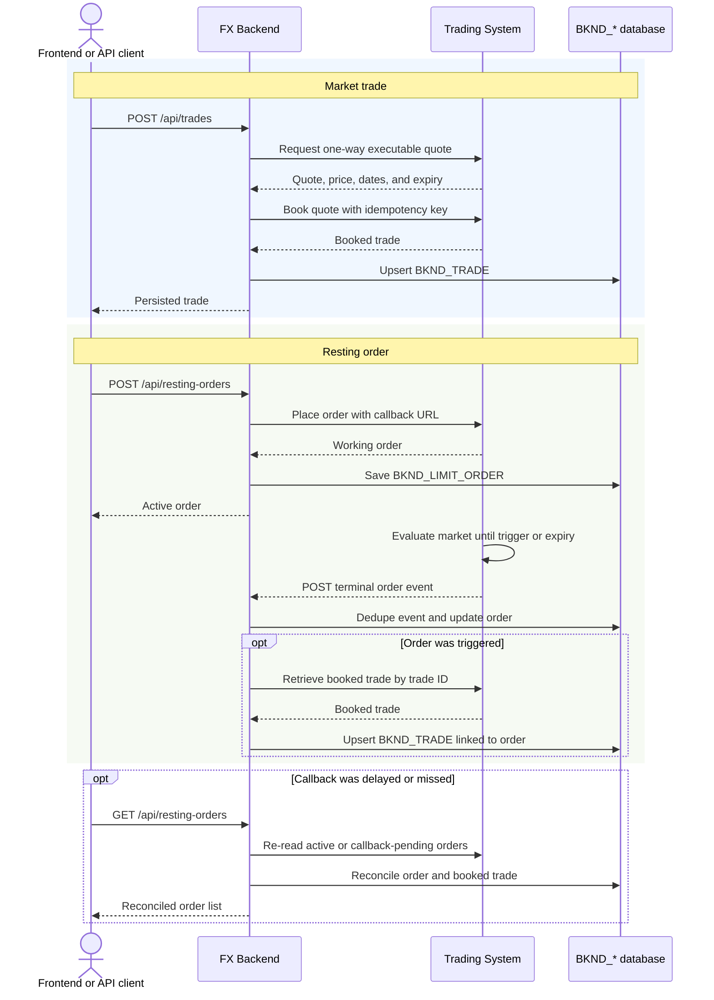

# FX Backend Functionalities

The backend is the workspace-facing service for the FX trading application. It exposes REST endpoints on
port `8080`, coordinates pricing and execution with the Trading System on port `8090`, stores operational
records, and produces daily PDF reports.

## System overview

The backend does not duplicate Trading System pricing or execution logic. It uses Java interfaces and models
generated from the authored [Trading Systems API contract](../open-api-spec/src/main/resources/META-INF/resources/openapi/fx-trading-systems-api.yaml),
with the [TradingSystemGateway](src/main/java/com/example/fx/backend/tradingsystem/TradingSystemGateway.java)
providing one boundary for timeouts and remote error handling.

## Functional areas

| Area | REST endpoint | Backend behavior |
| --- | --- | --- |
| Login | `POST /api/login` | Validates an existing demo user or creates a new one with defaults, updates the last-login time, and records every successful login for reporting. |
| Price list | `GET /api/rates` | Requests two-way prices for the configured instrument and tenor set. A complete price snapshot is cached for one second. |
| Price grid | `GET /api/rates/grid` | Filters by search text and tenor, sorts by pair, update time, or spread, and limits the returned two-way quotes. |
| Trade history | `GET /api/trades` | Returns locally persisted trades in newest-first order. |
| Market trade | `POST /api/trades` | Validates the request, asks the Trading System for a one-way quote, books it with an idempotency key, and persists the booked trade. |
| Resting orders | `GET /api/resting-orders` | Returns active or historical orders. Before responding, it reconciles active or callback-pending orders with the Trading System. |
| Submit order | `POST /api/resting-orders` | Creates a GTC or GTD resting order in the Trading System and persists the returned working state. |
| Amend order | `PUT /api/resting-orders/{orderId}` | Changes quantity, limit price, time in force, expiry, or comments on an active order. |
| Cancel order | `DELETE /api/resting-orders/{orderId}` | Cancels an active order in the Trading System and stores its terminal state. |
| Order callback | `POST /api/resting-orders/events` | Receives triggered or expired events, deduplicates them by event ID, updates the order, and recovers the booked trade for executions. |
| Notifications | `GET /api/notifications?limit=12` | Combines recent trades, order status changes, and market observations into a bounded workspace feed. |
| Daily reports | `GET /api/reports/daily/{report-type}?date=YYYY-MM-DD` | Reads the operational database and returns a downloadable PDF blob for one business date. |

## Trade and resting-order lifecycle

Market trades and resting-order executions both finish in `BKND_TRADE`. The `EXECUTION_TYPE` field distinguishes
market execution from limit execution, while `LIMIT_ORDER_ID` links a limit execution back to its originating
order.

## Daily PDF reports

The report endpoint accepts one of these report types:

| Report type | Contents |
| --- | --- |
| `executed-orders` | Resting orders executed during the selected business date. |
| `trades` | All trades booked during the selected business date. |
| `users-logged-in` | Successful login counts plus first and last login time for each user. |
| `users-traded` | Trading activity grouped by trader, including pairs, customers, and first/last trade time. |
| `live-orders` | Orders that were live at the end of the selected business date. |

If `date` is omitted, the backend uses the current date in `reports.zone-id`, which defaults to
`Asia/Singapore`. Future dates are rejected. The PDF response includes `Content-Disposition`, `X-Report-Date`,
and `X-Report-Record-Count` headers and is marked `no-store`.

The [PDF writer](src/main/java/com/example/fx/backend/reporting/PdfReportWriter.java) creates a landscape,
multi-page table with report metadata, page numbers, and an explicit empty result when no rows match. The
[batch scripts](batch/README.md) can download each report individually or all five together. They use retries,
timeouts, PDF content checks, and atomic file replacement so an interrupted run does not leave a partial report.

## Persistence model

All application-owned Oracle objects use the `BKND_` prefix. The same entity model is used by the default H2
development database.

| Table | Purpose |
| --- | --- |
| `BKND_FX_USER` | Demo user profile and most recent successful login. |
| `BKND_USER_LOGIN_EVENT` | Append-only successful-login history used by daily reporting. |
| `BKND_LIMIT_ORDER` | Local view of Trading System resting orders, lifecycle state, callback state, and desk metadata. |
| `BKND_TRADE` | Booked market and limit-order trades, pricing details, settlement dates, and desk metadata. |
| `BKND_ID_BLOCK_ALLOCATION` | Durable counter blocks used to generate sortable IDs across threads, restarts, and instances. |

`BKND_USER_LOGIN_EVENT.USERNAME` references `BKND_FX_USER.USERNAME`, and
`BKND_TRADE.LIMIT_ORDER_ID` optionally references `BKND_LIMIT_ORDER.ID`. The complete Oracle schema and indexes
are documented in [the SQL folder](sql/README.md).

## Operational behavior

- The backend is a Spring Boot application and uses Spring Data JPA for transactions and persistence.
- H2 is the default local database; its console is available at `/h2-console`, and its optional TCP server uses
  port `9092`.
- Oracle environments should install the scripts in `backend/sql` and set Hibernate DDL handling to `validate`
  or `none`.
- Trading System connection URL, timeouts, channel, segment, customer, callback URL, quantity, and instruments
  are configured under `trading-system.client.*`.
- Request boundary logging records HTTP method, path, status, and duration without logging request bodies or
  credentials.
- Local browser clients are allowed CORS access to `/api/**` from `localhost` or `127.0.0.1` on any port.
- The [sequential ID generator](src/main/java/com/example/fx/backend/support/SequentialIdGenerator.java) reserves
  database-backed counter blocks and emits nine-character IDs beginning with the configured backend system
  identifier, `B` by default.

## Source map

- [Authentication](src/main/java/com/example/fx/backend/auth)
- [Pricing, trades, orders, and notifications](src/main/java/com/example/fx/backend/pricing)
- [Daily reporting](src/main/java/com/example/fx/backend/reporting)
- [Trading System integration](src/main/java/com/example/fx/backend/tradingsystem)
- [Shared backend support](src/main/java/com/example/fx/backend/support)
- [Runtime configuration](src/main/resources/application.properties)
- [Oracle DDL scripts](sql)
- [Daily report batch scripts](batch)
