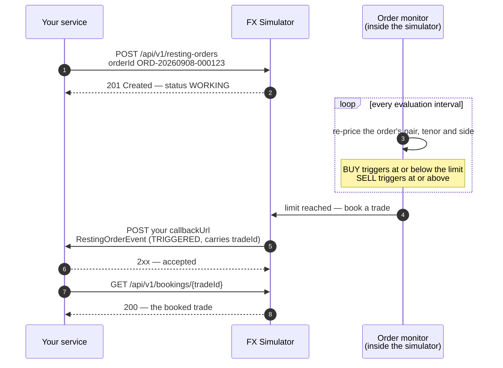
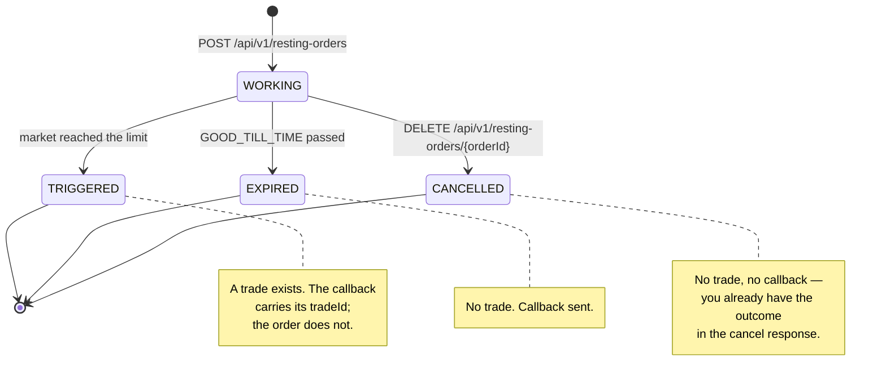
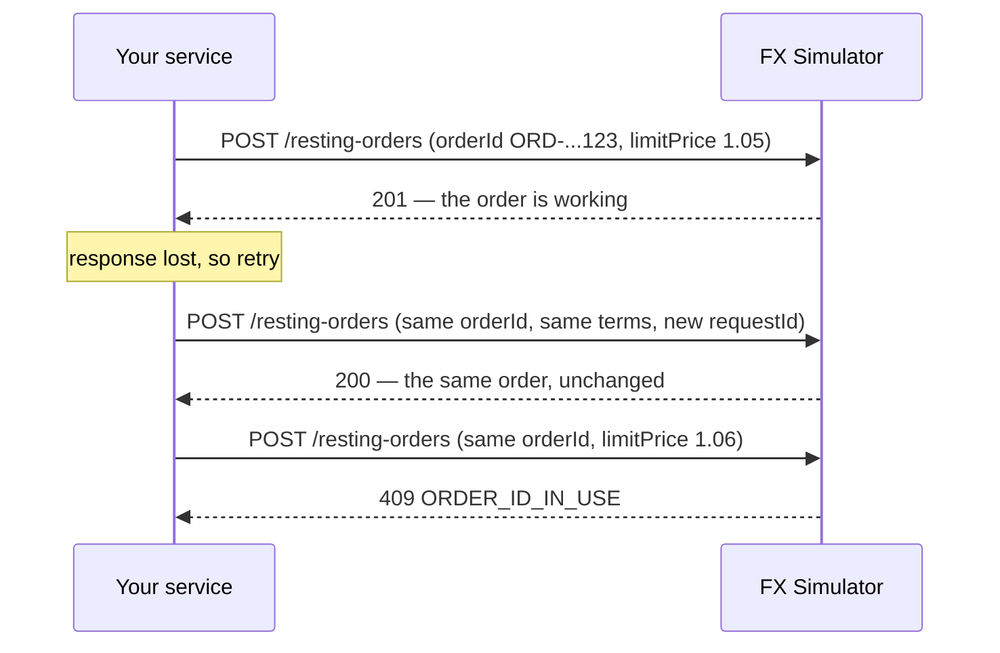
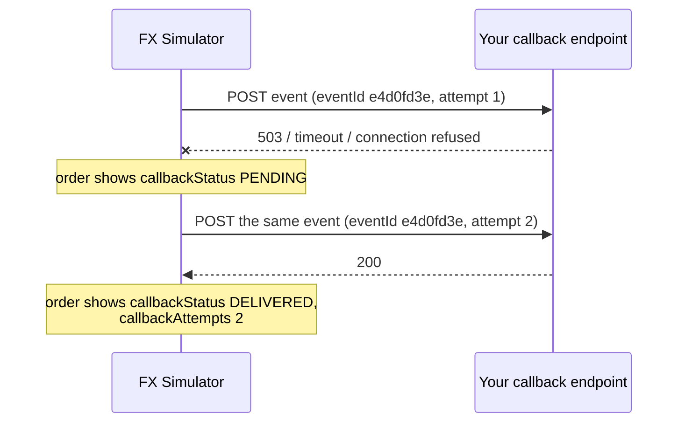

# Using the resting order API

A resting order sits inside the simulator until the market reaches its price. Because that can happen
minutes after you placed it, the API is asynchronous: you place an order and get an acknowledgement, and
the simulator calls **you** back when the order reaches a terminal state.

A resting order — an order with a `limitPrice` — is the only resting order type today. The resource is named
for the category so later types can join it without a second set of endpoints.

All examples run against a local simulator on port `8090`.

## The shape of the conversation



The order never changes price on its own: the fill takes the price quoted at the evaluation that
triggered it, which is at or through your limit, never the limit itself.

## Order lifecycle



Terminal states are final. A cancellation that races an evaluation loses: if the order triggered first it
stays `TRIGGERED`, the trade stands, and the cancel returns `409`.

## 1. Place an order

Every request carries the same identification as the rest of the API — `requestId`, `channel`, `segment`,
`customerId`. You also **name the order** with `orderId`: that name is how you address it from then on, and
it is the idempotency key, so placement takes no `Idempotency-Key` header.

```bash
curl -X POST http://localhost:8090/api/v1/resting-orders \
  -H 'Content-Type: application/json' \
  -d '{
    "requestId": "order-2026-09-08-0001",
    "orderId": "ORD-20260908-000123",
    "channel": "WEB",
    "segment": "C",
    "customerId": "0000123456",
    "currencyPair": "EURUSD",
    "quantity": 1000000,
    "quantityCurrency": "EUR",
    "tenor": "ONE_MONTH",
    "side": "BUY",
    "limitPrice": 1.05000,
    "timeInForce": "GOOD_TILL_CANCELLED",
    "callbackUrl": "http://localhost:8080/api/resting-orders/events"
  }'
```

`201 Created`:

```json
{
  "requestId": "order-2026-09-08-0001",
  "channel": "WEB",
  "segment": "C",
  "customerId": "0000123456",
  "originalRequestId": "order-2026-09-08-0001",
  "responseId": "443eac00-3c76-463c-bbb1-8622283e6afc",
  "responseAt": "2026-09-08T01:38:51.982476Z",
  "orderId": "ORD-20260908-000123",
  "currencyPair": "EURUSD",
  "quantity": 1000000,
  "quantityCurrency": "EUR",
  "tenor": "ONE_MONTH",
  "side": "BUY",
  "limitPrice": 1.05,
  "timeInForce": "GOOD_TILL_CANCELLED",
  "status": "WORKING",
  "placedAt": "2026-09-08T01:38:51.981347Z",
  "callbackUrl": "http://localhost:8080/api/resting-orders/events",
  "callbackStatus": "NOT_REQUIRED",
  "callbackAttempts": 0
}
```

`originalRequestId` always identifies the request that created the order, while `requestId` echoes
whichever request you are looking at right now.

**`orderId` is yours to choose** — up to 100 characters of letters, digits, `.`, `_`, `:` or `-`. Two
customers may safely use the same value. Reusing one of your own for a *different* order is a `409`:

```json
{
  "type": "urn:problem:fx-simulator:order-id-in-use",
  "title": "Order id in use",
  "status": 409,
  "detail": "Order ORD-20260908-000123 already exists for this customer.",
  "errorCode": "ORDER_ID_IN_USE"
}
```

`orderId` does double duty: it names the order — the URL you fetch and cancel with, and the id every
callback carries — and it makes placement idempotent, which the next section covers.

**Side and limit price** describe `quantityCurrency` from the customer's point of view, quoted in the
currency pair's orientation (quote currency per base currency):

| Side | Triggers when |
| --- | --- |
| `BUY` | the executable client price is **at or below** `limitPrice` |
| `SELL` | the executable client price is **at or above** `limitPrice` |

A limit that is already reachable triggers at the first evaluation after placement — there is no rejection
for "marketable" orders.

**Time in force** is either `GOOD_TILL_CANCELLED` (no `expiresAt`) or `GOOD_TILL_TIME` (`expiresAt`
required, and it must be in the future). Sending the wrong combination is a `400`.

**`callbackUrl`** must start with one of the simulator's configured allowed prefixes, so the simulator can
never be aimed at an arbitrary host. Anything else is refused before the order rests:

```json
{
  "type": "urn:problem:fx-simulator:callback-url-not-allowed",
  "title": "Callback URL not allowed",
  "status": 422,
  "detail": "The simulator is not configured to deliver events to https://elsewhere.example.com/events.",
  "errorCode": "CALLBACK_URL_NOT_ALLOWED"
}
```

## 2. Retries are safe

The `orderId` is what makes placement safe to repeat after a timeout. Send it again with the same terms and
you get the original order back; send it with different terms and the simulator refuses rather than resting
a second order under a name that is taken.



A replay is a `200`, not a `201`, and returns a fresh `responseId` and `responseAt` over the unchanged
order — `placedAt` and every term stay as they were. Only `requestId` may differ between a placement and its
retry; everything else must match, or it is a different order and gets the `409`.

The name is held for as long as the order is retained, which outlasts the order closing. After that the
`orderId` is free again.

## 3. Watch the order

```bash
curl "http://localhost:8090/api/v1/resting-orders/ORD-20260908-000123" \
  -H 'X-Request-Id: order-status-0004' \
  -H 'X-Channel: WEB' \
  -H 'X-Segment: C' \
  -H 'X-Customer-Id: 0000123456'
```

Lookups carry the same identification as headers, and they must match the order's own channel, segment and
customer — a mismatch is a `404`, never someone else's order.

A working order reports its most recent evaluation, so you can see why it has not triggered:

```json
{
  "status": "WORKING",
  "lastEvaluatedAt": "2026-09-08T01:38:52.207839Z",
  "lastEvaluatedPrice": 1.10167
}
```

A closed order adds `closedAt`. It never describes the fill — no `tradeId`, no executed price. The order
resource is about the order; the execution is described by the callback event and by the trade itself:

```json
{
  "orderId": "ORD-20260908-000456",
  "status": "TRIGGERED",
  "placedAt": "2026-09-08T01:38:52.027200Z",
  "lastEvaluatedAt": "2026-09-08T01:38:52.207839Z",
  "lastEvaluatedPrice": 1.10167,
  "closedAt": "2026-09-08T01:38:52.207839Z",
  "callbackStatus": "DELIVERED",
  "callbackAttempts": 1
}
```

Polling is only for inspection. **The callback is how you learn the outcome** — you never have to poll for it.

## 4. Receive the callback

When the order becomes `TRIGGERED` or `EXPIRED`, the simulator POSTs a `RestingOrderEvent` to your
`callbackUrl` as `application/json`. Reply with any `2xx`; the body is ignored.

A `TRIGGERED` event repeats the whole booked trade, so you can act on the fill without calling back:

```json
{
  "eventType": "TRIGGERED",
  "eventId": "46123f2d-94cc-426f-8710-0364ca5f8aff",
  "occurredAt": "2026-09-08T01:38:52.207839Z",
  "attempt": 1,
  "orderId": "ORD-20260908-000456",
  "originalRequestId": "order-2026-09-08-0030",
  "channel": "WEB",
  "segment": "C",
  "customerId": "0000123456",
  "currencyPair": "EURUSD",
  "quantity": 1000000,
  "quantityCurrency": "EUR",
  "tenor": "ONE_MONTH",
  "side": "BUY",
  "limitPrice": 1.15,
  "status": "TRIGGERED",
  "tradeId": "fec7de17-d1f1-4338-9a68-247cb1aee0a7",
  "coverPrice": 1.10163,
  "clientPrice": 1.10167,
  "swapPoints": 0.00202,
  "buyCurrency": "EUR",
  "buyQuantity": 1000000.0,
  "sellCurrency": "USD",
  "sellQuantity": 1101670.0,
  "spotDate": "2026-09-10",
  "valueDate": "2026-10-12"
}
```

An `EXPIRED` event has no trade, and carries the expiry that elapsed plus the last price seen:

```json
{
  "eventType": "EXPIRED",
  "eventId": "08ba3be0-5439-4d5b-94d4-9a27b3e7ceea",
  "occurredAt": "2026-09-08T01:13:04.524071Z",
  "attempt": 1,
  "orderId": "ORD-20260908-000789",
  "originalRequestId": "order-2026-09-08-0080",
  "status": "EXPIRED",
  "limitPrice": 0.5,
  "expiresAt": "2026-09-08T01:13:04.341425Z",
  "lastEvaluatedPrice": 1.10169
}
```

Switch on `eventType` — it is the discriminator, and `TRIGGERED` is the only variant with `tradeId`.

### Delivery is at least once



- `eventId` is **stable across retries**, and `attempt` counts up. Deduplicate on `eventId`; do not treat
  two deliveries as two fills.
- Backoff doubles between attempts. After the configured attempt limit the order's `callbackStatus`
  becomes `FAILED` — the fill still stands, only the notification gave up. Treat `FAILED` as an alert that
  needs a human: the order will tell you it reached `TRIGGERED`, but since it carries no `tradeId`,
  identifying the trade means reconciling out of band.
- Delivery runs separately from evaluation, so a slow endpoint delays only its own retries.
- The order itself always shows where delivery stands:

| `callbackStatus` | Meaning |
| --- | --- |
| `NOT_REQUIRED` | still working, or cancelled — nothing to deliver |
| `PENDING` | queued or awaiting retry |
| `DELIVERED` | a `2xx` was received |
| `FAILED` | attempts exhausted; recover by reading the order |

Your endpoint should be quick and idempotent. Acknowledge first, then do your own work.

## 5. Fetch the trade

The event's `tradeId` is how you reach the trade — an ordinary booked trade, retrievable through the normal
booking endpoint with the same identification headers:

```bash
curl "http://localhost:8090/api/v1/bookings/$TRADE_ID" \
  -H 'X-Request-Id: from-event' \
  -H 'X-Channel: WEB' \
  -H 'X-Segment: C' \
  -H 'X-Customer-Id: 0000123456'
```

The trade is registered *before* the event is queued, so a `tradeId` you receive in a callback is always
retrievable. Keep it: the order will not give it to you again.

## 6. Cancel

```bash
curl -X DELETE "http://localhost:8090/api/v1/resting-orders/ORD-20260908-000123" \
  -H 'X-Request-Id: order-cancel-0061' \
  -H 'X-Channel: WEB' \
  -H 'X-Segment: C' \
  -H 'X-Customer-Id: 0000123456'
```

`200 OK` returns the closed order with `status: "CANCELLED"` and a `closedAt`. Cancelling anything that is
no longer working is a `409`:

```json
{
  "type": "urn:problem:fx-simulator:order-not-working",
  "title": "Order not working",
  "status": 409,
  "detail": "Resting order ORD-20260908-000123 is CANCELLED and can no longer be cancelled.",
  "errorCode": "ORDER_NOT_WORKING"
}
```

## Errors at a glance

Every failure is `application/problem+json` and echoes whatever identification the request carried.

| Status | `errorCode` | Cause |
| --- | --- | --- |
| 400 | `INVALID_RESTING_ORDER` | time-in-force and `expiresAt` disagree, `expiresAt` is past, `limitPrice` is not positive, or `orderId` is malformed |
| 400 | `INVALID_REQUEST` | schema violation |
| 404 | `ORDER_NOT_FOUND` | no such order **for this channel, segment and customer** |
| 409 | `ORDER_ID_IN_USE` | this customer already has a *different* order under that `orderId` |
| 409 | `ORDER_NOT_WORKING` | cancelling an order that already closed |
| 422 | `CALLBACK_URL_NOT_ALLOWED` | `callbackUrl` is outside the configured prefixes |
| 422 | `UNSUPPORTED_INSTRUMENT` | the simulator has no market for that currency pair |
| 503 | `CAPACITY_EXCEEDED` | the order store is full; retry later with the same key |

## Things worth knowing

- Orders live in memory and do not survive a simulator restart, which also releases the `orderId`s they held.
- Evaluation is periodic, not continuous, so triggering is not instantaneous and a brief spike through
  your limit between evaluations is not seen.
- The authoritative contract, including the callback operation, is at
  `http://localhost:8090/openapi/fx-simulator-api.yaml`, browsable at `/swagger-ui.html`.
