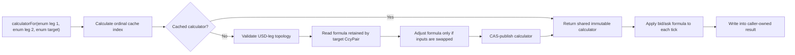

# CcyPairCrosser: production and high-frequency optimization review

## Executive summary

`CcyPairCrosser` started as a convenient stateless utility: pass three string symbols and four
prices, rediscover the currency route, calculate the cross, and return a new array. That design is
readable, but it mixes two workloads with very different lifetimes:

- instrument topology changes rarely;
- bid/ask values may change millions of times per second.

The current implementation separates those lifetimes. `CcyPair` records one standard USD pair per
currency, and every cross-pair constant explicitly declares its arithmetic formula. On the first
lookup of an ordered combination, that formula is adjusted only for input order, placed in an
immutable `CrossRateCalculator`, and atomically cached. Each later tick executes its preselected
formula. The caller can reuse a two-element result array, making the steady-state path
allocation-free.

The production API assumes pair strings are already uppercase. It does not call `toUpperCase`,
perform locale-sensitive conversion, or provide a lowercase fallback. Code that already knows the
instrument should use `CcyPair` directly and avoid string lookup altogether.

Relevant files:

- [Currency enum](../src/main/java/com/example/util/Ccy.java)
- [Currency-pair enum](../src/main/java/com/example/util/CcyPair.java)
- [Current crosser](../src/main/java/com/example/util/CcyPairCrosser.java)
- [Correctness and cache tests](../src/test/java/com/example/util/CcyPairCrosserTest.java)
- [Micro-harness](../src/test/java/com/example/util/CcyPairCrosserMicroHarness.java)
- [Harness runner](../../../scripts/run-ccy-pair-crosser-micro-harness.sh)

## Scope and explicit assumptions

The component derives a target pair from two pairs that each contain exactly one USD leg:

```text
EURUSD bid/ask + USDJPY bid/ask -> EURJPY bid/ask
```

Its contract is intentionally narrow:

- pair strings passed to the compatibility API are exact uppercase `CcyPair` names;
- supported currencies and pairs are the compile-time enum universe;
- every currency has exactly one USD pair in standard market convention;
- the two input legs must have distinct non-USD currencies;
- input order is significant because the four price arguments use the same order;
- the caller owns snapshot coherence, timestamps, venue choice, staleness checks, and rounding.

This is a USD-intermediated cross calculator, not a general currency-route graph.

## Evolution from the first version

| Concern | First version | Current version |
|---|---|---|
| Instrument type | Six-character `String` | `CcyPair` enum with resolved `Ccy` fields |
| Uppercase handling | Conversion/normalization on calls | Uppercase is a caller precondition |
| Pair decomposition | Repeated substring parsing | Resolved once during enum initialization |
| Route selection | Repeated searches and branches | Cross formula retained by `CcyPair` |
| Calculator lifecycle | Created as part of every calculation | Created on the first ordered-combination lookup |
| Cache key | None | Collision-free index from three enum ordinals |
| Cache hit | Not applicable | One index calculation and one atomic array read |
| Temporary key | Not applicable | None |
| Result storage | New `double[2]` per call | Caller-owned reusable array is supported |
| Concurrency | Stateless method | Immutable calculator, CAS publication |
| Validation | Basic quote checks | Topology, finite price, spread, output, and buffer checks |
| Performance verification | Demonstration code | Unit tests plus a separate micro-harness |

### What the first version repeated

On every price update, the original shape could repeat:

1. pair-length and quote validation;
2. uppercase conversion and substring extraction;
3. confirmation that each input contained USD;
4. searches for the target base and quote currencies;
5. direct/inverse direction selection;
6. construction of intermediate bid/ask arrays;
7. allocation of the final result array.

The loops were short, so asymptotic complexity was never the issue. The problem was recomputing
stable topology on the volatile tick path, creating garbage and branch variation at high rates.

### Intermediate packed-symbol cache

An intermediate optimization encoded three-letter ASCII currencies into integers and six-letter
pairs into longs, then used a bounded open-addressing cache. That removed substring allocation and
temporary compound keys, but it still parsed symbols for lookup, needed hashing and collision
probing, and required capacity/exhaustion logic.

The enum design supersedes that layer. Pair identity and decomposition are now application-domain
data rather than values reconstructed from bytes. Enum ordinals also allow a direct cache slot, so
symbol packing, hashing, probing, and case normalization all disappear.

## Current domain model

### `Ccy`

`Ccy` is only the supported currency-code universe. The enum name is the canonical three-letter
market-data code. It includes the fiat currencies and precious-metal codes used by this
application. It deliberately contains no pair direction or calculation metadata.

Using enum identity gives constant-time reference comparisons such as:

```java
pair.base() == Ccy.USD
```

No string comparison or currency-code allocation is needed.

### `CcyPair`

Every supported pair stores:

- its base `Ccy`;
- its quote `Ccy`;
- whether it is a valid USD leg;
- for a cross, its explicitly declared canonical `CrossRateFormula`.

These fields are final and resolved at class initialization. The pricing path therefore never
slices `EURUSD` into `EUR` and `USD` or rediscovers how two standard USD orientations combine.

Only standard USD instruments are enum constants. For example, `EURUSD`, `GBPUSD`, `AUDUSD`, and
`NZDUSD` coexist with `USDJPY`, `USDCAD`, `USDCHF`, and `USDNOK`; reverse aliases such as `USDEUR`
and `JPYUSD` are deliberately absent.

The enum is also an allowlist. Adding a new market requires an explicit `CcyPair` constant, and
adding a new currency first requires a `Ccy` constant. This is appropriate for a stable production
instrument universe and makes unsupported input fail early.

The string adapter uses `CcyPair.valueOf(symbol)`. Therefore `"EURUSD"` is accepted while
`"eurusd"` and unknown pairs are rejected. This is deliberate; uppercase protection would add
work for a condition the caller guarantees.

Tests assert that each pair name equals `base.name() + quote.name()`. They also reconstruct the
expected formula from the actual canonical USD-pair constants and compare it with every declared
cross formula. This prevents either symbol metadata or formula orientation from silently drifting.

## Compile once, execute many times



### First lookup

For an ordered `(first input, second input, target)` combination, `createCalculator`:

1. confirms both inputs are USD legs;
2. confirms they represent different non-USD currencies;
3. confirms the target currencies are supplied by those legs;
4. copies a USD target directly from its matching canonical input, or reads the formula already
   retained by a cross-pair enum;
5. reverses only the order-sensitive division formula when callers supply the legs in target-quote
   order rather than target-base order.

This work is performed only on a cache miss. A correctly configured service should resolve and
retain its calculators during startup, moving both validation and first-publication contention out
of live trading.

### Formula selection

Because reverse USD aliases are not supported, a target involving USD simply copies its matching
canonical input pair. No runtime USD-leg inversion path remains.

For non-USD targets, the four orientation cases are:

| Base source | Quote source | Cross bid | Cross ask |
|---|---|---:|---:|
| `BASE/USD` | `QUOTE/USD` | `baseBid / quoteAsk` | `baseAsk / quoteBid` |
| `BASE/USD` | `USD/QUOTE` | `baseBid * quoteBid` | `baseAsk * quoteAsk` |
| `USD/BASE` | `QUOTE/USD` | `1 / (baseAsk * quoteAsk)` | `1 / (baseBid * quoteBid)` |
| `USD/BASE` | `USD/QUOTE` | `quoteBid / baseAsk` | `quoteAsk / baseBid` |

The opposite side in division is essential. Using bid/bid or ask/ask would produce a
non-executable or incorrectly narrowed spread.

### Example

For `EURUSD + USDJPY -> EURJPY`, USD cancels:

```text
EUR/USD * USD/JPY = EUR/JPY

EURJPY bid = EURUSD bid * USDJPY bid
EURJPY ask = EURUSD ask * USDJPY ask
```

At `EURUSD 1.0850/1.0852` and `USDJPY 145.300/145.350`, the result is
`EURJPY 157.6505/157.73382`.

## Direct ordinal cache

If `N` is `CcyPair.values().length`, the ordered triple maps to:

```text
index = (first.ordinal * N + second.ordinal) * N + target.ordinal
```

The `AtomicReferenceArray` has `N³` slots, so every possible ordered enum triple has exactly one
collision-free position. With the current 46 pair constants, this is 97,336 reference slots. Only
valid combinations that are actually requested receive calculator objects.

Compared with the intermediate hash cache, the hit path has:

- no string parsing on the enum API;
- no key allocation;
- no hash calculation;
- no collision comparison or linear probe;
- no eviction or capacity-exhaustion branch;
- one atomic array read after integer index arithmetic.

Input order remains part of identity:

```text
(EURUSD, USDJPY, EURJPY) != (USDJPY, EURUSD, EURJPY)
```

The two calculators implement the same market result but consume quote arguments in different
positions.

### Concurrent first publication

On a miss, each contender may construct an immutable candidate. `compareAndSet` publishes one
candidate, and losing threads return the published winner. All subsequent callers receive that
same object. Tests exercise a contended first lookup and assert one returned identity.

The calculator is safe to share because it contains only a final formula enum. Caller-provided
result arrays are mutable and must be thread-confined or otherwise owned safely.

## Production APIs

### Preferred retained calculator

Resolve enum combinations at startup and keep the calculator with instrument state:

```java
private final CcyPairCrosser.CrossRateCalculator eurJpyCalculator =
        CcyPairCrosser.calculatorFor(
                CcyPair.EURUSD,
                CcyPair.USDJPY,
                CcyPair.EURJPY);

// Confined to this pricing loop.
private final double[] crossQuote = new double[2];

void onPrice(double eurUsdBid, double eurUsdAsk,
             double usdJpyBid, double usdJpyAsk) {
    eurJpyCalculator.crossRate(
            eurUsdBid, eurUsdAsk,
            usdJpyBid, usdJpyAsk,
            crossQuote);
}
```

This checked path is allocation-free with reusable storage and validates inputs and output.

### Unchecked retained calculator

`crossRateUnchecked(...)` removes quote, destination, and output checks. Use it only behind a
boundary that already guarantees:

- finite, strictly positive bid and ask;
- `bid <= ask` for both inputs;
- a result array of length at least two;
- safe ownership of the result array.

It is an internal trust-boundary optimization, not the right API for external messages or
untrusted feed values.

### Exact-uppercase string adapter

The string overloads remain for compatibility:

```java
CcyPairCrosser.calculatorFor("EURUSD", "USDJPY", "EURJPY");
```

They perform three exact `Enum.valueOf` lookups and then enter the same enum cache. They do not
normalize case. Convert a symbol to `CcyPair` once at configuration or subscription time instead
of using the string adapter for every tick.

### One-shot calculation

`CcyPairCrosser.crossRate(...)` reuses the cached calculator but returns a new `double[2]`. It is
convenient for occasional work. For a streaming pipeline, retain the calculator and result buffer.

## Correctness and production hardening

The current checked design rejects:

- unsupported or lowercase string pair names;
- input pairs without exactly one USD leg;
- duplicate non-USD input currencies;
- targets whose currencies cannot be supplied by the inputs;
- non-finite prices, including `NaN` and infinity;
- zero or negative prices;
- crossed input markets where `bid > ask`;
- invalid or overflowing calculated output;
- result buffers shorter than two elements.

Calculated output is validated before either result element is published, so a failure does not
leave the caller with a half-written quote.

The checks do not establish whether two input prices form a coherent market-data snapshot. The
caller must enforce timestamps, sequences, staleness, and venue rules before invoking the
calculator.

## Micro-harness results

The dependency-free harness is a local regression tool, not a replacement for JMH. One observed
run used OpenJDK 21.0.9, 200,000 operations per round, three warm-up rounds, and five measurement
rounds:

| Scenario | Median ns/op | Observed bytes/op |
|---|---:|---:|
| Retained checked calculator | 2.19 | 0.00 |
| Retained unchecked calculator | 0.67 | 0.00 |
| Enum cached lookup, reused result | 0.87 | 0.00 |
| String adapter lookup, reused result | 4.87 | 0.00 |
| Enum one-shot, locally consumed | 2.58 | 0.00 |
| Enum one-shot, escaping result | 6.55 | 32.00 |

In this run, exact string adaptation was about 5.6 times the direct enum lookup. The locally
consumed one-shot array was eliminated by HotSpot escape analysis, while the deliberately escaping
array measured 32 bytes per operation. Production code must not depend on escape analysis; an
array that crosses a method, queue, or publication boundary can allocate.

Sub-nanosecond and low-single-digit timings are highly sensitive to inlining, constant folding,
CPU frequency, JVM version, and harness structure. Treat them as comparative signals on this
machine, not latency guarantees. A formal report should use JMH forks, multiple JVMs, profilers,
and a preserved first-version benchmark.

Run from the repository root:

```bash
./scripts/run-ccy-pair-crosser-micro-harness.sh
```

Optional arguments are operations per round, warm-up rounds, and measurement rounds.

## Test coverage

Run from `fx-parent-pom`:

```bash
mvn -pl fx-pricing-rs -am test
```

`CcyPairCrosserTest` covers:

- enum name/base/quote metadata consistency;
- exactly one standard-convention USD leg for every supported non-USD currency;
- all four formulas retained by cross-pair enum constants;
- both input orders and both cross directions;
- direct canonical USD targets;
- checked, unchecked, allocating, and reusable-result APIs;
- exact-uppercase string adaptation and lowercase rejection;
- unsupported and ambiguous topology;
- `NaN`, infinity, zero, crossed markets, and arithmetic overflow;
- fail-before-publish result behavior;
- same-instance reuse by enum and string adapter;
- distinct cache entries for reversed input order;
- concurrent first lookup converging on one published calculator.

## Trade-offs and remaining responsibilities

### Finite enum universe

The direct cache is possible because supported instruments are finite. A new currency or pair is a
source change and deployment, not dynamically accepted configuration. This improves predictability
but is unsuitable for an unbounded multi-tenant symbol universe.

When adding an instrument:

1. add the currency code to `Ccy` if it is new;
2. add its one standard uppercase USD pair to `CcyPair`;
3. add any supported crosses with an explicit formula in `CcyPair`;
4. add formula-direction tests when the new pair exercises a new production route;
5. rerun unit tests and the micro-harness.

### Cache footprint

The direct table grows cubically with the number of pair enum constants. At the current size it is
small and bounded. If the pair universe grows substantially, reconsider the three-dimensional
table and benchmark a two-level or preconfigured dense cache. Do not change it based only on
theoretical size; measure the actual heap and lookup latency.

### `double` arithmetic

`double` is appropriate for low-latency streaming price derivation, but this component does not
apply pip precision or commercial rounding. Round once at the correct publication or execution
boundary. Accounting and settlement may require decimal arithmetic elsewhere.

### Fixed USD intermediary

Supporting arbitrary intermediate currencies would require route planning, cycle controls,
snapshot rules, and venue policy. That is a separate component rather than an extension of this
formula cache.

## Production checklist

- Convert configured symbols to `CcyPair` once, before the pricing loop.
- Resolve and retain calculators during startup.
- Treat input order as part of configuration.
- Prefer the checked API unless upstream validation is equivalent and enforced.
- Reuse a thread-confined `double[2]` result buffer on the hot path.
- Verify input timestamps, sequences, venues, and staleness before crossing.
- Apply pair-specific rounding at the downstream boundary.
- Add enum metadata and route tests whenever the supported universe changes.
- Track allocation rate, tail latency, deoptimizations, and GC in production.
- Re-run the harness after formula, enum, compiler, or JVM changes.

## Conclusion

The decisive optimization is lifecycle separation. The first version rediscovered stable string
topology on every quote. The current version keeps one market-standard USD leg per currency,
retains each cross formula in `CcyPair`, adapts only input order on a first lookup, publishes one
immutable calculator, and leaves numeric work on the tick path. Direct ordinal caching, explicit
uppercase preconditions, reusable result storage, strong validation, and concurrency tests make
the component suitable for a controlled high-frequency pricing pipeline while keeping its
operational boundaries explicit.
